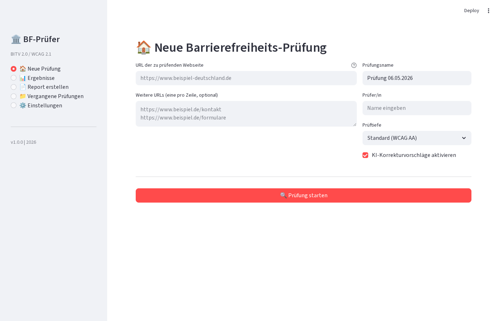

# 🏛️ KI-Barrierefreiheits-Prüfer – BITV 2.0 / WCAG 2.1 für Behörden

**KI-gestützter Scanner für barrierefreie Webseiten der öffentlichen Verwaltung**



DE: Automatisierte Prüfung von Behörden-Webseiten auf Barrierefreiheit gemäß BITV 2.0, WCAG 2.1 (Level A & AA) und dem Barrierefreiheitsstärkungsgesetz (BFSG 2025). Self-hosted, DSGVO-konform, sofort einsetzbar.

EN: Automated accessibility scanner for government websites. Checks against BITV 2.0, WCAG 2.1 (Level A & AA) and the German Accessibility Strengthening Act (BFSG 2025). Self-hosted, GDPR-compliant, ready to use.

---

## 🔑 Rechtlicher Kontext

- **BITV 2.0**: Barrierefreie-Informationstechnik-Verordnung – verbindlich für Bundesbehörden
- **WCAG 2.1**: Web Content Accessibility Guidelines – internationaler Standard (Level A + AA)
- **EU Web Accessibility Directive (2016/2102)**: Europäische Richtlinie für barrierefreie Webangebote öffentlicher Stellen
- **Barrierefreiheitsstärkungsgesetz (BFSG)**: Trifft ab 28.06.2025 auch private Anbieter barrierefreier Dienstleistungen
- **EN 301 549**: Europäischer Standard für barrierefreie ICT-Produkte und -Dienstleistungen

## ✨ Features

- **Multi-Seiten-Scanner**: Komplette Webseiten (URL-Liste oder Sitemap) prüfen
- **WCAG 2.1 Regeln**: 15+ Regeln für Level A und AA
- **KI-Korrekturvorschläge**: Automatische Vorschläge per Ollama (lokal) oder Claude API
- **Kontrastprüfung**: Farbwerte und Kontrastverhältnisse automatisch ermitteln
- **HTML/PDF-Reports**: Professionelle, druckoptimierte Berichte für Behörden
- **DSGVO-konform**: Alle Daten lokal, keine externen API-Keys nötig (Ollama-Modus)
- **Self-Hosted**: Docker-basiert, einfach部署
- **Deutschsprachig**: Oberfläche, Reports und KI-Prompts auf Deutsch

## 📋 Systemanforderungen

- Python 3.10+
- Docker & Docker Compose (optional)
- Ollama (optional, für lokale KI) oder Claude API Key
- 4 GB RAM Minimum (8 GB empfohlen für KI-Features)
- 2 GB freier Festplattenplatz

## 🚀 Installation

### Schnellstart mit Docker

```bash
git clone https://github.com/ceeceeceecee/barrierefreiheits-pruefer.git
cd barrierefreiheits-pruefer
cp .env.example .env
docker-compose up -d
```

### Manuelle Installation

```bash
git clone https://github.com/ceeceeceecee/barrierefreiheits-pruefer.git
cd barrierefreiheits-pruefer
python -m venv venv
source venv/bin/activate
pip install -r requirements.txt
streamlit run app.py
```

## 📁 Projektstruktur

```
barrierefreiheits-pruefer/
├── app.py                    # Streamlit Web-App
├── scanner/
│   ├── page_scanner.py       # HTML-Parser & Seiten-Scanner
│   └── wcag_rules.py         # WCAG-Regelmaschine
├── processor/
│   └── ai_provider.py        # Ollama / Claude API Provider
├── prompts/
│   ├── alt_text.txt          # Prompt: Alt-Text generieren
│   ├── violation_explain.txt # Prompt: Verstoß erklären
│   └── fix_suggestion.txt    # Prompt: HTML-Korrektur
├── reporter/
│   ├── html_reporter.py      # HTML-Report-Generator
│   └── pdf_reporter.py       # PDF-Export (WeasyPrint)
├── templates/
│   └── report.html.j2        # Jinja2 Report-Template
├── database/
│   ├── schema.sql            # PostgreSQL-Schema
│   └── db_manager.py         # Datenbank-Zugriff
├── docs/
│   ├── rechtlicher-kontext.md
│   ├── setup-guide.md
│   └── nutzungsgrenzen.md
├── docker-compose.yml
├── .env.example
├── requirements.txt
└── LICENSE
```

## ⚠️ Nutzungsgrenzen & Haftungsausschluss

Dieses Tool dient als **Unterstützung** bei der Barrierefreiheitsprüfung und ersetzt **keine** manuelle Prüfung durch zertifizierte Auditoren. KI-generierte Vorschläge können halluzinieren und sollten immer manuell überprüft werden. Für die rechtssichere Konformitätserklärung ist eine professionelle Zertifizierung erforderlich.

## 📄 Lizenz

MIT License – siehe [LICENSE](LICENSE)

## 👤 Autor

KI- & Automation-Freelancer mit Spezialisierung auf Behördendigitalisierung
